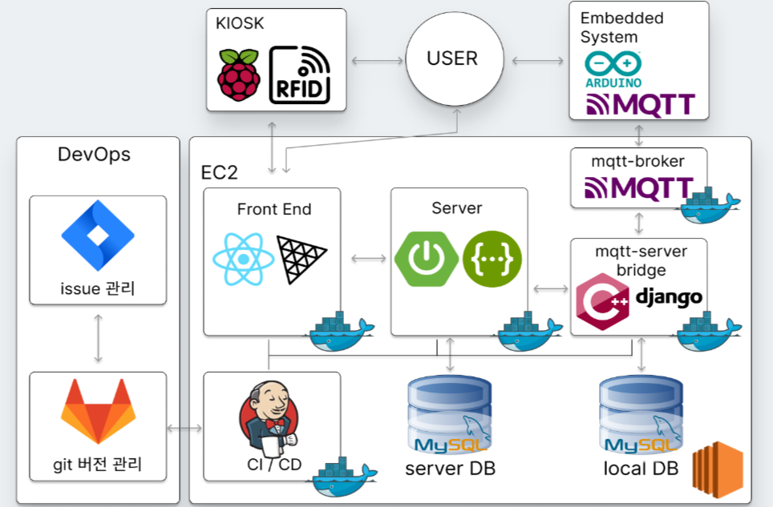
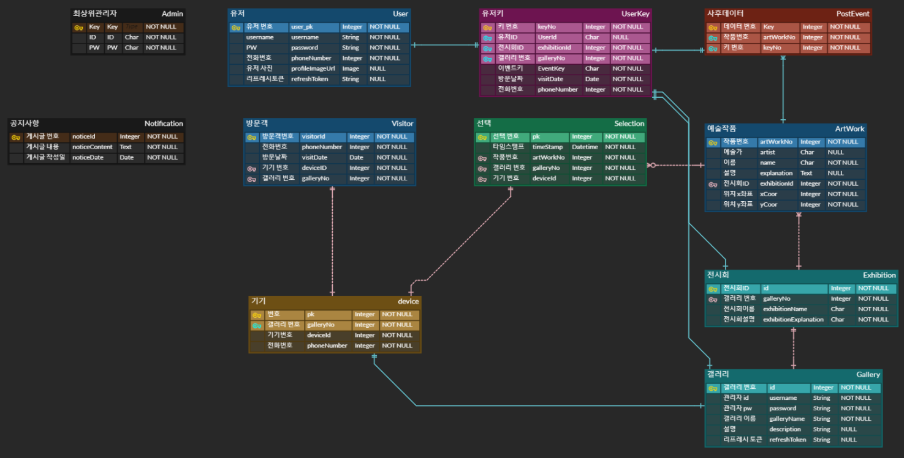

# ArtLink

## 카테고리

| Application                       | Domain                                | Language                      | Framework                            |
| --------------------------------- | ------------------------------------- | ----------------------------- | ------------------------------------ |
| :white_check_mark: Desktop Web    | :black_square_button: AI              | :white_check_mark: JavaScript | :black_square_button: Vue.js         |
| :black_square_button: Mobile Web  | :black_square_button: Big Data        | :white_check_mark: TypeScript | :white_check_mark: React             |
| :white_check_mark: Responsive Web | :black_square_button: Blockchain      | :white_check_mark: C/C++      | :black_square_button: Angular        |
| :black_square_button: Android App | :white_check_mark: IoT                | :black_square_button: C#      | :black_square_button: Node.js        |
| :black_square_button: iOS App     | :black_square_button: AR/VR/Metaverse | :white_check_mark: ​Python    | :black_square_button: Flask/Django   |
| :black_square_button: Desktop App | :black_square_button: Game            | :black_square_button: Java    | :white_check_mark: Spring/Springboot |
|                                   |                                       | :black_square_button: Kotlin  |                                      |

## 프로젝트 소개

- 프로젝트명 : ArtLink

- 서비스 특징: 웹 IoT 프로젝트

- 주요 기능

  - 관람자가 인상적이었던 작품 기록 및 조회

- 주요 기술

  - Single Page Application
  - Responsive Web Application
  - UWB

  - REST API

- 배포 환경

  - URL: https://i9a202.p.ssafy.io/

  - 테스트 계정:
    | Role|ID|Password|
    |:-:|:-:|:-:|
    | User | ssafy_user | 1234
    | Gallery | ssafy_gallery | 1234
    | Admin | ssafy_admin | 1234

## 팀 소개

|  이름  |                     역할                     |
| :----: | :------------------------------------------: |
| 박건희 |          팀장, 임베디드 시스템 개발          |
| 김수현 |             백엔드 개발, DB 설계             |
| 배정원 |      프론트엔드 개발, 기능 구현 및 설계      |
| 김진현 |          백엔드 개발, API 문서 관리          |
| 조재웅 | 기획 담당 및 임베디드 시스템 개발, 도커 개발 |
| 조준하 |        프론트엔드 개발 및 디자인 담당        |

## 프로젝트 상세 설명

### 개발 환경

**AWS EC2 Ubuntu 20.04 LTS**

**Window 10**

### 기술 스택

#### FrontEnd

|                                        TypeScript                                        |                                                                    Three.js                                                                     |                                        React                                        |                                             ESLint                                             |                               Vite                                |                                        React Router                                        |
| :--------------------------------------------------------------------------------------: | :---------------------------------------------------------------------------------------------------------------------------------------------: | :---------------------------------------------------------------------------------: | :--------------------------------------------------------------------------------------------: | :---------------------------------------------------------------: | :----------------------------------------------------------------------------------------: |
|  |  |  |  |  |  |

#### BackEnd

|                                        Java                                        |                                      SpringBoot                                      |                                        Nginx                                        |                                        Docker                                        |
| :--------------------------------------------------------------------------------: | :----------------------------------------------------------------------------------: | :---------------------------------------------------------------------------------: | :----------------------------------------------------------------------------------: |
|  |  |  |  |

#### Embedded

|                                           C++                                           |                                        Python                                        |                                               Arduino                                                |                                         Raspberry Pi                                         |                                                   MQTT                                                    |
| :-------------------------------------------------------------------------------------: | :----------------------------------------------------------------------------------: | :--------------------------------------------------------------------------------------------------: | :------------------------------------------------------------------------------------------: | :-------------------------------------------------------------------------------------------------------: |
|  |  |  |  |  |

#### Database

|                                        MySQL                                        |                                                          AWS                                                          |
| :---------------------------------------------------------------------------------: | :-------------------------------------------------------------------------------------------------------------------: |
|  |  |

#### Version Managing

|                                        Git                                        |                                        Gitlab                                        |                                                      Jira                                                      |
| :-------------------------------------------------------------------------------: | :----------------------------------------------------------------------------------: | :------------------------------------------------------------------------------------------------------------: |
|  |  |  |

### 시스템 구성도

### ERD

### 🔗 [UCC](https://youtu.be/5Un3q0GKFCQ)

### 웹사이트 살펴보기

#### 🔗 [User](https://youtu.be/E-OMx1Or-jg)

#### 🔗 [Gallery](https://youtu.be/yDGN31KiTq8)

#### 🔗 [Admin](https://youtu.be/RqA36a-tj3A)

#### 🔗 [Kiosk](https://youtube.com/shorts/10W5KVgX_Dw?feature=share)
