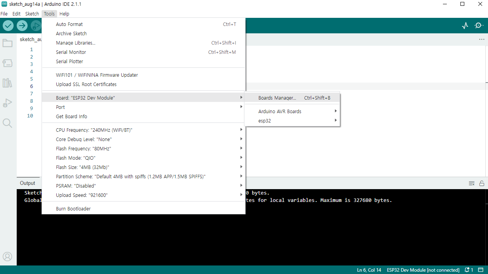
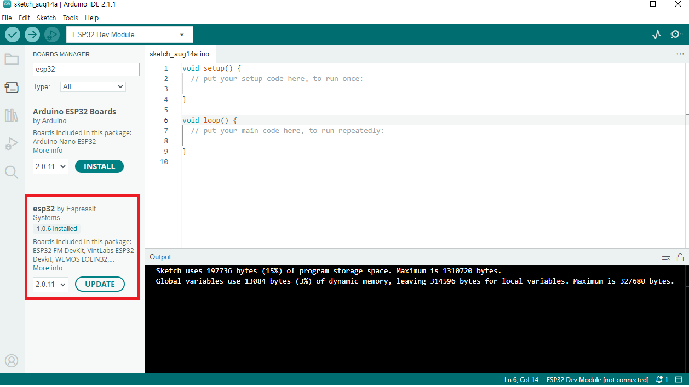
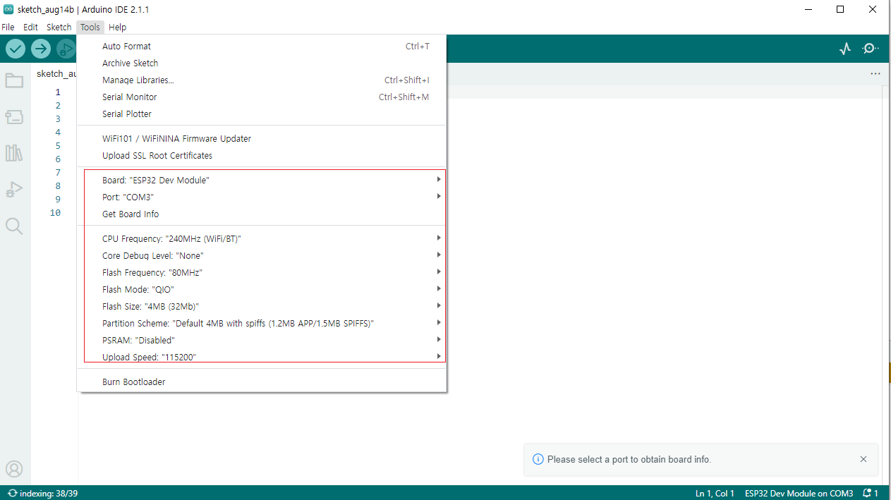
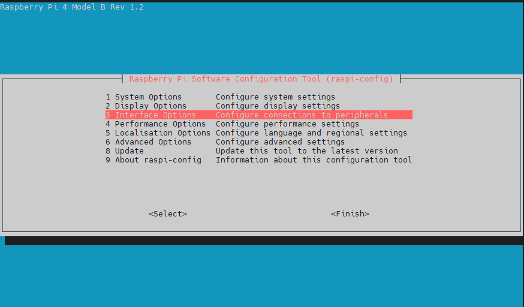

# 1. 포팅 메뉴얼

## a. 사용 기술 스택

## b. 포팅 메뉴얼

### EC2 Setup
SSL 을 위한 키 설치
CERTBOT 설치를 진행해줍니다.
- docker image로 제공되는 certbot은 nginx과 관련해서 제공하지 않기 때문에 실행되는 도메인에 pem 키를 설치해서 진행하였습니다.
 

cp ./exec/application.properties ./WAS/projecttest1/src/main/resources
<br>
cp ./exec/docker-compose.yml ./

### Embedded Setup - User Device

1. Arduino IDE 설치<br>
    [Arduino IDE](https://www.arduino.cc/en/software)를 설치합니다.
    해당 사이트에서 자신의 운영체제와 맞는 프로그램을 다운로드합니다.<br>
    이 때, Arduino 파일 경로가 생성되는 경로를 기억해야 합니다.<br>
    일반적으로, `C:\Users\{사용자명}\Documents\Arduino` 에 경로가 생성됩니다.
2. ESP32 board 설정<br>
    사용하는 보드는 ESP32 보드입니다. Arduino-IDE 환경에서 이 보드를 다루기 위해서는 추가 설정이 필요합니다.<br>Arduino-IDE 에서 `File -> Preference` (한국어 버전이면 `파일 -> 환경설정`)을 클릭합니다.<br>
    해당 부분을 클릭하고, 다음 Url을 입력합니다.<br>
    `https://dl.espressif.com/dl/package_esp32_index.json`
    <br>
    `Tools -> Board -> Board manager` 로 이동합니다.
    <br>
    이동 후, `esp32` 를 검색하고, 아래 그림에 나온 매니저 파일을 다운로드 합니다.<br>
    (README 작성 환경에서는 이미 설치가 되어있었습니다.)
    <br>
    이 과정이 완료되면, `Tools -> Board` 에 `ESP32 Dev Module` 가 보입니다. 선택해 줍니다.
    
3. PC - Board 연결<br>
    PC와 ESP32 보드를 연결합니다. 보드가 연결된 USB Port 를 확인하고, IDE에서도 인식이 되었는지 확인합니다.<br>
    Port 연결이 정상적으로 나올 경우, 다음과 같은 이미지가 나와야 합니다.
    <br>
    만약 인식이 안 될 경우, 디바이스 드라이버를 추가로 설치해야 합니다.<br>
    [해당 링크](https://www.silabs.com/documents/public/software/CP210x_Windows_Drivers.zip)의 zip 파일 안의 실행 파일을 실행 후, 3 과정을 다시 수행합니다.

4. 사용 라이브러리 다운로드<br>
    `C:\Users\{사용자명}\Documents\Arduino\libraries` 폴더 내에 사용할 라이브러리를 저장합니다.
    해당 프로젝트에서는 다음 라이브러리들의 폴더를 저장합니다.
    - Arduino-DW1000
    - pubsubclient
5. 회로 구성
    다음 이미지와 같이 회로를 구성합니다.
    
6. 스케치 파일 생성<br>
    새 스케치 파일을 생성합니다.<br>
    파일을 생성할 때, `Anchor` 혹은 `Tag` 용도에 따라 파일 이름을 설정합니다.<br>
    해당 이름으로 생성된 폴더에 `.ino` 파일 및 의존 라이브러리 파일들을 저장합니다.<br>
    이 후 board에 스케치 업로드를 진행합니다.

### Embedded Setup - Kiosk

1. Rpi4 Cricuit
   RPI 의 회로도는 다음과 같습니다. 아래 그림과 같이 회로를 구성합니다.
   

2. SPI connect Setting
    RFID 리더기와 Rpi4는 SPI 통신으로 데이터를 주고 받습니다. 따라서 회로 구성 후 SPI 사용 설정을 진행합니다.

    `sudo raspi-config`

    이후 다음 이미지와 같이 설정을 진행합니다.

    

    

    

    `Interface Options -> SPI -> Yes`

3. Rotate Display
        
    해당 프로젝트는 600 * 1024 해상도로 구현이 되어 있습니다. 이에 맞게 화면 설정을 진행합니다.

    아래와 같이 `config.txt` 파일과 `40-libinput.conf` 설정 파일을 변경해 줍니다.

    `sudo vi /boot/config.txt`

    ```
    # 해당 라인은 주석처리
    #dtoverlay=vc4-kms-v3d
    # 이하 라인은 추가
    display_hdmi_rotate=1
    hdmi_group=2
    hdmi_mode=87
    hdmi_cvt=1024 600 60 6 0 0 0
    hdmi_drive=1
    hdimi_force_hotplug=1
    ```

    `sudo nano /usr/share/X11/xorg.conf.d/40-libinput.conf`

    ```
    Section "InputClass"
        Identifier "libinput touchscreen catchall"
        MatchIsTouchscreen "on"
        Option "TransformationMatrix" "0 1 0 -1 0 1 0 0 1"
        MatchDevicePath "/dev/input/event*"
        Driver "libinput"
    EndSection
    ```

    2번, 3번 설정이 완료되었으면, `sudo reboot`를 통해 rpi4를 재시작합니다.

4. Install Libraries
    재시작 후, 파이썬 및 라이브러리들을 설치합니다.

    `sudo apt-get install python3`

    `sudo apt-get install python-rpi.gpio`

    `sudo pip3 install pi-rc522`

    `pip3 install selenium`

5. Start KIOSK.py
    이 후 `python3 KIOSK.py` 실행합니다.

# 2. 외부 API

# 3. DB 덤프 파일

# 4. 시연 시나리오

## 0. 시연 준비
### 필요 인원
카메라멘 ( 촬영 ), 직원(유저 디바이스 관리), 관람객(관람)
### 장소
멀티캠퍼스 역삼 8층 휴게 공간


## 1. 갤러리 입장
관람객이 미술관에 입장<br>
직원이 핸드폰 번호와 기기를 매칭해서, 사용자 기기를 제공해 줌
## 2. 관람 시작
관람객이 관람을 하며, 자신이 마음에 드는 작품 앞에서 사용자 기기의 등록 버튼을 누름<br>
만약 방금 누른 작품을 다시 빼고 싶다면 사용자 기기의 삭제 버튼을 누름<br>
작품은 5개정도 관람하고, 작품 등록은 2~3개 정도를 함.
## 3. 갤러리 퇴장
관람을 마치고 퇴장구 쪽에 비치된 키오스크에 사용자 기기를 태깅.<br>
키오스크에서 관람하면서 등록한 미술품들이 나오고, 이 미술품들의 상세 정보를 볼 수 있음.<br>
삭제를 하고 싶은 미술품도 키오스크에서 삭제 가능
## 4. 나만의 페이지 발급
이렇게 담은 내 작품들을 나만의 페이지에서 확인이 가능.